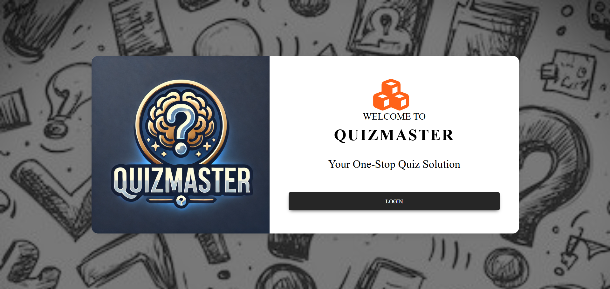
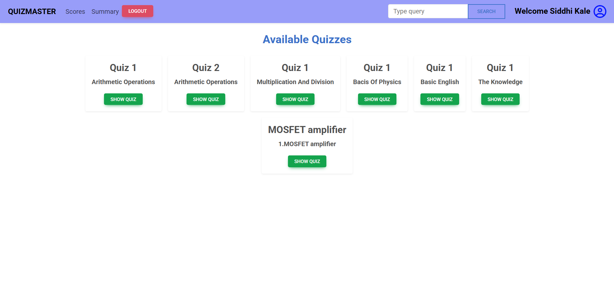
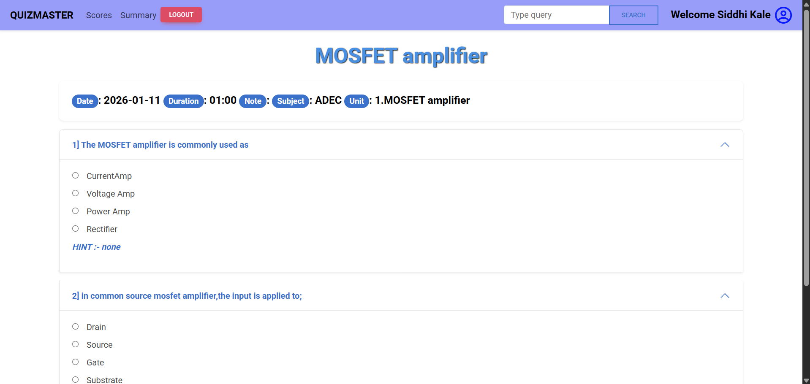
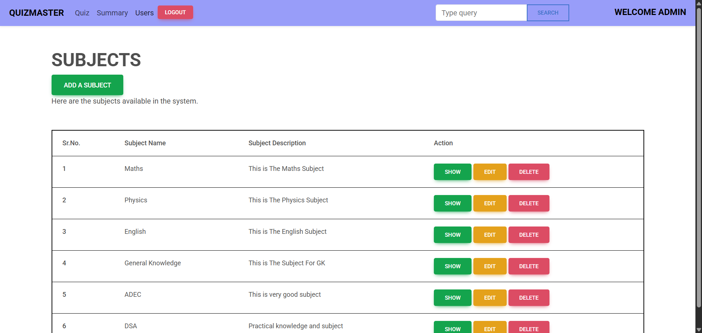
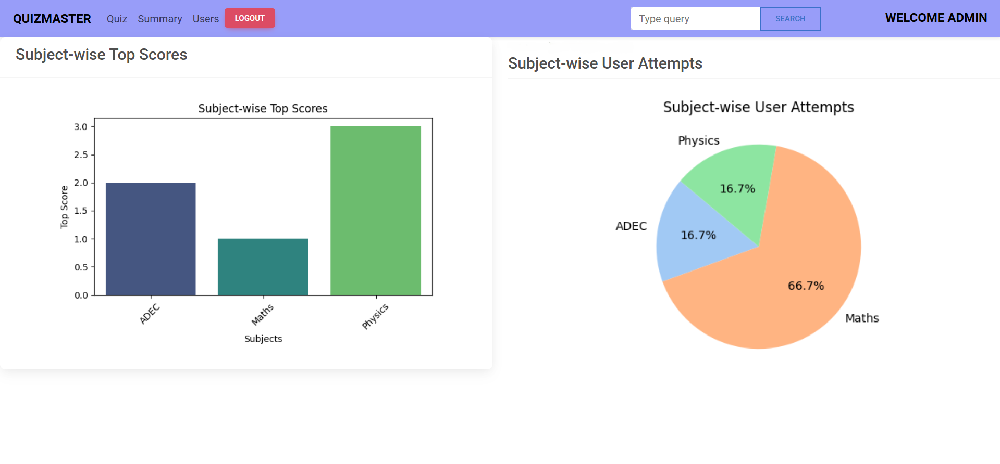

# QuizMaster 🧠

QuizMaster is a full-stack web-based quiz application that allows users to attempt quizzes across multiple subjects while enabling administrators to manage quizzes, users, and performance analytics through an interactive dashboard.

This project was developed as part of the BS Degree in Data Science and Applications at IIT Madras.

---

## 🚀 Features

### 👤 User Features
- View available subjects, units, and quizzes.
- Attempt quizzes with multiple-choice questions
- Instant score calculation and feedback
- Track performance using charts and graphs
- Edit personal profile details
- Search quizzes by subject, unit, or quiz name.

### 🛠 Admin Features
- Create, edit, and delete Subjects, Units, Quizzes, and Questions
- Manage users (flag/unflag users)
- Add hints to quiz questions
- View subject-wise top scores and quiz attempts
- Analyze results using visualizations.

---

## 📊 Data Visualization
- Score trends displayed using graphs and pie charts.
- Subject-wise performance analytics.
- User ranking insights.
- Visualizations generated using Matplotlib and Seaborn.

---

## 🛠 Tech Stack

**Frontend**
- HTML
- CSS
- Bootstrap

**Backend**
- Flask
- SQLAlchemy (ORM)

**Template Engine**
- Jinja2

**Database**
- SQLite

**Data Visualization**
- Matplotlib
- Seaborn

**Development Tools**
- Visual Studio Code
- Python Virtual Environment

---

## 🏗 Project Architecture

```text
QuizMaster/
│
├── application/
│   ├── templates/        # HTML templates
│   ├── static/           # CSS files & images
│   ├── models/           # Database models
│   ├── routes/           # Application logic & controllers
│
├── instance/
│   └── database.sqlite3  # SQLite database
│
├── main.py               # Application entry point
└── README.md


## ▶️ How to Run the Project

```bash
# Create virtual environment
python -m venv venv

# Activate virtual environment
venv\Scripts\activate   # Windows
source venv/bin/activate # macOS/Linux

# Install dependencies
pip install -r requirements.txt

# Run the application
python main.py
```
---
📽 Project Demo

🎥 Presentation Video:
https://drive.google.com/file/d/1Zv0ve98wdyl41vHbVuEV-97YRNjKN3Sq/view

---

## 📸 Screenshots

<table>
  <tr>
    <td align="center"><b>Login Page</b></td>
    <td align="center"><b>User Dashboard</b></td>
  </tr>
  <tr>
    <td></td>
    <td></td>
  </tr>
  <tr>
    <td align="center"><b>Quiz Page</b></td>
    <td align="center"><b>Admin Dashboard</b></td>
  </tr>
  <tr>
    <td></td>
    <td></td>
  </tr>
</table>

<p align="center">
  <b>Performance Analytics</b><br>
  
</p>


---

📚 What I Learned

- Full-stack development using Flask
- MVC-style project structuring
- Database design with SQLAlchemy
- Data visualization using Python libraries
- Git & GitHub workflow

---

## 👨‍🎓 Author
**Bhushan Dattatray Sonawane**  
BS Degree in Data Science and Applications, IIT Madras.  
📧 23f2003210@ds.study.iitm.ac.in  
📧 bhushan.sonawane.tech@gmail.com


---


